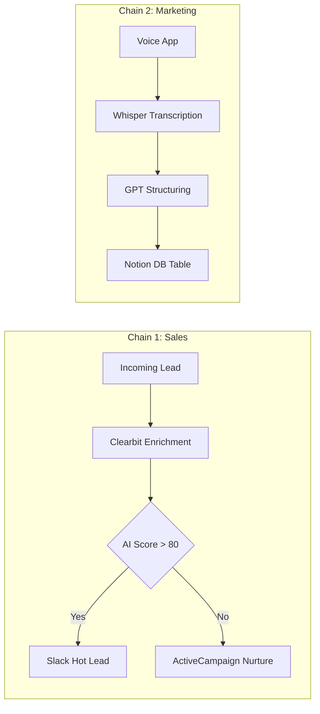

# n8n Automation Library

[](https://github.com/USERNAME/REPO_NAME/actions/workflows/python-tests.yml)

I spend a lot of time in n8n and Python building automations for marketing and ops work — things that used to take me (or my clients) hours every week. This repo is where I keep the ones worth keeping.

### Why Dual-Format?
Everything here is dual-format: an **n8n workflow JSON** you can import and run in minutes, and an equivalent **Python script** for people who'd rather just run a file headlessly on a cron job or test it locally. Both do the same job. By building modularly, individual automations can be snapped together to form larger "Systems":



---

## What's in here

Mostly things I've actually needed:

- Pulling data out of Google Search Console without clicking through the UI every morning
- Sending emails from a spreadsheet on a schedule (embarrassingly useful)
- Tracking whether competitor pricing pages have changed
- Getting AI to tell me which Facebook ads to kill before I spend more money on them

Some of these are polished. Some are still rough around the edges — I've noted those where relevant.

---

## 📂 Structure

```
automations/
└── <automation-name>/
    ├── README.md           # What it does, setup, known issues
    ├── workflow.json       # n8n export — import directly
    ├── workflow.py         # Python equivalent
    ├── test_workflow.py    # Offline unit tests using unittest/pytest
    ├── .env.example        # Environment variable template
    └── requirements.txt

templates/
└── automation-template/    # Boilerplate for new additions
```

---

## 🚀 How to run these

### n8n
1. Open your n8n instance
2. **Import workflow** → select the `workflow.json`
3. Follow the setup steps in the automation's `README.md`
4. Activate

### Python
```bash
cd automations/<automation-name>
pip install -r requirements.txt
cp .env.example .env   # fill in your keys
python workflow.py
```

### Testing
```bash
cd automations/<automation-name>
pip install -r requirements.txt
python -m pytest test_workflow.py -v
```

---

## ⚡ Automations

| Name | Category | Description |
|------|----------|-------------|
| [webhook-to-google-sheet](automations/webhook-to-google-sheet/) | General | Capture webhook payloads and append rows to Google Sheets |
| [rss-to-slack](automations/rss-to-slack/) | Marketing | Monitor RSS feeds and post new items to Slack |
| [ai-content-summariser](automations/ai-content-summariser/) | AI | Summarise any URL with OpenAI, output Markdown |
| [scheduled-email-from-sheets](automations/scheduled-email-from-sheets/) | Marketing | Read a Google Sheet and send emails on their target date |
| [search-console-to-sheets](automations/search-console-to-sheets/) | Marketing | Pull GSC keyword/page data to Sheets on a schedule |
| [landing-page-cro-analyser](automations/landing-page-cro-analyser/) | AI / Marketing | Submit a URL, get AI-powered CRO recommendations |
| [keyword-rank-tracker](automations/keyword-rank-tracker/) | Marketing | Track top 5 SERP results for keywords, log to Sheets |
| [competitor-price-tracker](automations/competitor-price-tracker/) | Marketing | Scrape competitor pricing pages, alert on changes |
| [linkedin-ai-content-poster](automations/linkedin-ai-content-poster/) | Marketing / AI | Fully autonomous LinkedIn content pipeline |
| [multi-page-web-scraper](automations/multi-page-web-scraper/) | Tech | Configurable recursive scraper with pagination support |
| [news-aggregator](automations/news-aggregator/) | Tech | Pull from NewsAPI, Mediastack, CurrentsAPI into one store |
| [facebook-ad-ai-analyser](automations/facebook-ad-ai-analyser/) | AI / Marketing | Score ad creatives against account benchmarks with Gemini |
| [b2b-lead-researcher](automations/b2b-lead-researcher/) | AI / Tech | Scrape company pages, synthesise into Airtable CRM records |
| [competitor-campaign-monitor](automations/competitor-campaign-monitor/) | Marketing / Tech | Weekly Slack digest of competitor page changes |
| [email-performance-reporter](automations/email-performance-reporter/) | Marketing | Pull Mailchimp campaign stats and log to Google Sheets weekly |
| [google-ads-alert](automations/google-ads-alert/) | Marketing | Flag campaigns where CPA or CPC exceeds threshold, alert via Slack |
| [seo-content-brief-generator](automations/seo-content-brief-generator/) | AI / Marketing | Keyword → SERP research → OpenAI → structured content brief |
| [meeting-action-extractor](automations/meeting-action-extractor/) | AI / General | Parse a meeting transcript and extract structured action items to CSV or Notion |
| [lead-enrichment-router](automations/lead-enrichment-router/) | Sales | Enrich emails via Clearbit, AI score them, and route hot leads to Slack |
| [voice-to-notion-pipeline](automations/voice-to-notion-pipeline/) | Productivity | Transcribe Telegram voice notes with Whisper and log structured ideas into Notion |
| [invoice-vision-processor](automations/invoice-vision-processor/) | Operations | Rip PDF attachments, use Vision AI to extract line items, log to Airtable |

---

## 🤝 Contributing

See [CONTRIBUTING.md](CONTRIBUTING.md). Basic rule: if it needs more than 15 minutes of setup to get running, it's not ready.

---

## 📄 License

MIT — use it, break it, improve it.
